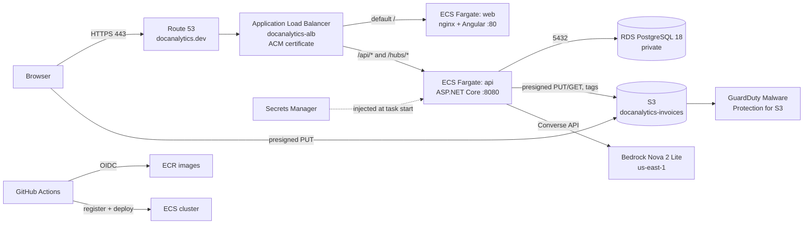

# AWS Infrastructure

How DocAnalytics runs on AWS: what each piece is, why it exists, how it is wired together, how it is deployed, and how to rebuild or tear it all down.

- **Region:** `ap-south-1` (Mumbai) for everything, except Amazon Bedrock which runs in `us-east-1`
- **Public URL:** `https://docanalytics.dev`
- **Provisioning:** Terraform (`infra/`) for the app platform, plus a short list of manual resources (see [What Terraform manages](#3-what-terraform-manages-and-what-it-does-not))
- **Delivery:** GitHub Actions (`.github/workflows/deploy.yml`) using OIDC, no long-lived AWS keys

> Placeholders used below: `<ACCOUNT_ID>` is your 12-digit AWS account, `<VPC_ID>` your default VPC, `<RDS_ENDPOINT>` the database host.

---

## 1. Architecture



### Request routing

| Path | Target group | Service |
|---|---|---|
| `/api/*` | `tg-api` (port 8080) | API |
| `/hubs/*` (SignalR websockets) | `tg-api` (port 8080) | API |
| everything else | `tg-web` (port 80) | web (nginx serving the Angular build) |

The same three rules exist on the HTTP:80 listener (created by Terraform) and the HTTPS:443 listener (created by hand, see section 6).

---

## 2. Resource inventory

| Area | Resource | Detail |
|---|---|---|
| Registry | ECR repos | `docanalytics-api`, `docanalytics-web`, `docanalytics-migrations`. Images are tagged with the git SHA. |
| Compute | ECS cluster | `docanalytics-cluster`, Fargate launch type |
| Compute | Service `docanalytics-api-svc` | 0.5 vCPU / 1 GB, container port 8080, 1 task |
| Compute | Service `docanalytics-web-svc` | 0.25 vCPU / 0.5 GB, container port 80, 1 task |
| Compute | Task `docanalytics-migrate` | 0.25 vCPU / 0.5 GB, one-shot EF Core migration run during each deploy |
| Network | Load balancer | `docanalytics-alb` (internet-facing ALB across 3 public subnets) |
| Network | Target groups | `tg-api` (health check `/api/v1/health`), `tg-web` (health check `/`) |
| Network | Security groups | `docanalytics-alb-sg`, `docanalytics-task-sg`, `docanalytics-db-sg` (rules below) |
| Network | VPC | Default VPC, 3 subnets, no NAT gateway (tasks get public IPs, locked down by security groups) |
| Data | RDS | PostgreSQL 18, `db.t4g.micro`, gp3 20 GB, single AZ, **not publicly accessible**, database `docanalytics` |
| Data | S3 | `docanalytics-invoices`, CORS for the production domain and localhost |
| AI | Bedrock | Amazon Nova 2 Lite, model id `us.amazon.nova-2-lite-v1:0`, region `us-east-1` |
| Security | GuardDuty | Malware Protection for S3 plan on the invoices bucket |
| Security | Secrets Manager | `docanalytics/rds-conn`, `docanalytics/jwt-key` |
| Security | ACM | Certificate for `docanalytics.dev` (DNS validated) |
| Security | IAM | OIDC provider, 3 roles (below) |
| DNS | Route 53 | Hosted zone `docanalytics.dev`, A (alias) record to the ALB |
| Logs | CloudWatch | `/ecs/docanalytics-api`, `/ecs/docanalytics-web`, `/ecs/docanalytics-migrate` |

### Security group rules

| Group | Inbound | Why |
|---|---|---|
| `docanalytics-alb-sg` | 80 and 443 from the internet | Public entry point |
| `docanalytics-task-sg` | 8080 and 80, **only from `alb-sg`** | Tasks are reachable only through the load balancer |
| `docanalytics-db-sg` | 5432, **only from `task-sg`** | Only the app can talk to the database |

### IAM roles

| Role | Used by | Permissions |
|---|---|---|
| `docanalytics-gha-deploy` | GitHub Actions (via OIDC) | Push to the `docanalytics-*` ECR repos, register task definitions, update ECS services, run the migration task, `iam:PassRole` for the two task roles. Trust is limited to `refs/heads/main` of this repo. |
| `docanalytics-task-exec` | ECS agent | Pull images, write logs (managed policy), read `docanalytics/*` secrets so ECS can inject them |
| `docanalytics-task-role` | The running API container | S3 get/put/delete/get-tagging on the invoices bucket, Bedrock invoke. No access keys: the SDK uses the task role automatically. |

---

## 3. What Terraform manages, and what it does not

**Managed by Terraform (`infra/`)**

- ECR repositories, ECS cluster, task definitions (bootstrap revision), ECS services
- ALB, both target groups, the **HTTP:80** listener and the `/api/*` and `/hubs/*` rules
- `alb-sg`, `task-sg`, and the rule letting tasks reach the database security group
- GitHub OIDC provider, the three IAM roles, the deploy and secret-read policies, the `docanalytics-task-s3` policy
- CloudWatch log groups

Service definitions use `ignore_changes = [task_definition, desired_count]`, because GitHub Actions registers a new task definition revision on every deploy and Terraform must not fight it.

**Created manually (not in Terraform)**

| Resource | How |
|---|---|
| RDS instance and `docanalytics-db-sg` | AWS CLI or console (section 6, step 2) |
| Secrets Manager secrets | CLI |
| S3 bucket, CORS, GuardDuty Malware Protection plan | Console or CLI |
| Bedrock model access | Console (us-east-1, Model access) |
| ACM certificate, **HTTPS:443 listener and its rules**, Route 53 records | CLI (section 6, step 6) |
| Extra task-role policies `docanalytics-bedrock-invoke`, `docanalytics-s3-invoices-rw` | Created by hand earlier; Terraform only knows about `docanalytics-task-s3` |

Because the HTTPS listener and DNS are manual, `terraform destroy` will fail on the target groups unless the 443 listener is deleted first (see section 8).

---

## 4. Configuration and secrets

Nothing sensitive is stored in the repo or in the task definition JSON.

| Setting | Source |
|---|---|
| `ConnectionStrings__Default` | Secrets Manager `docanalytics/rds-conn`, injected by ECS at task start |
| `Jwt__Key` | Secrets Manager `docanalytics/jwt-key` |
| Connection string format | `Host=<RDS_ENDPOINT>;Port=5432;Database=docanalytics;Username=postgres;Password=<pw>` |
| CORS allowed origins | `appsettings.Production.json` (`https://docanalytics.dev`) |
| S3 bucket name | `Aws:BucketName` in `appsettings.json` |
| Regions / model id | `Aws:Region`, `Aws:BedrockRegion`, `Aws:NovaModelId` |
| `ASPNETCORE_ENVIRONMENT=Production`, `ASPNETCORE_URLS=http://+:8080` | Task definition environment |

If a secret is deleted and recreated, its ARN gets a new random suffix. Update the ARNs in `deploy/api-task-def.json`, `deploy/migrate-task-def.json`, and `infra/terraform.tfvars` (`secret_arn`).

GitHub Actions secrets used by the deploy workflow:

| Secret | Value |
|---|---|
| `AWS_DEPLOY_ROLE_ARN` | Terraform output `deploy_role_arn` |
| `TASK_SG` | Terraform output `task_sg_id` |
| `PRIV_SUBNETS` | Comma separated subnet ids, no spaces |
| `PUBLIC_URL` | `https://docanalytics.dev` (used by the health smoke test) |

---

## 5. CI/CD pipeline (`deploy.yml`)

Runs on every push to `main` and on manual dispatch.

1. Assume `docanalytics-gha-deploy` through GitHub OIDC (no stored AWS keys) and log in to ECR.
2. Build and push the API image and the web image, tagged with the commit SHA.
3. Build an EF Core **migration bundle** (`dotnet ef migrations bundle`) and ship it as the `docanalytics-migrations` image.
4. **Gated migration:** run it as a one-off Fargate task inside the VPC (so it can reach RDS). If the exit code is not 0 the deploy stops, so there are no half-migrated releases.
5. Render and deploy the API task definition, then the web task definition, waiting for service stability.
6. **Smoke test:** poll `$PUBLIC_URL/api/v1/health` until it returns `"db":"connected"`.

---

## 6. Invoice upload pipeline (S3, GuardDuty, Bedrock)

```
Browser --presigned PUT--> S3 bucket --> GuardDuty scans, writes a tag
   |
   v  POST /files/{id}/complete
Extraction queue --> ExtractionWorker (background service in the API)
   1. Wait for the GuardDuty scan tag (fail closed; THREATS_FOUND deletes the file)
   2. Magic-byte check: file must start with %PDF-
   3. Download from S3, call Bedrock Nova 2 Lite (Converse API), parse JSON
   4. Validate totals (line sum vs subtotal vs grand total) and compute confidence
   5. Save invoice header and line items, update batch counters
```

Why these choices:

- **Presigned URLs** keep file bytes off the API; the browser uploads straight to S3, which is why the bucket needs CORS for the site origin.
- **GuardDuty gate fails closed:** if the scan tag never appears, the file is not processed. Disabling Malware Protection on the bucket makes every upload fail.
- **Bedrock in `us-east-1`** while S3 is in `ap-south-1`; the app supports split regions.

---

## 7. Build it from scratch (runbook)

Prerequisites: AWS CLI v2, Terraform 1.6+, Docker, GitHub CLI, an IAM user with admin rights, and a database dump if you are restoring data. Use a named profile and set `AWS_PROFILE`.

### Step 1: Variables

```powershell
$vpc = "<VPC_ID>"
$subs = (aws ec2 describe-subnets --filters Name=vpc-id,Values=$vpc --query "Subnets[].SubnetId" --output text) -split "\s+"
```

### Step 2: Database

```powershell
$dbsg = aws ec2 create-security-group --group-name docanalytics-db-sg --description "DocAnalytics RDS" --vpc-id $vpc --query GroupId --output text
$ip = (Invoke-RestMethod https://checkip.amazonaws.com).Trim()
aws ec2 authorize-security-group-ingress --group-id $dbsg --protocol tcp --port 5432 --cidr "$ip/32"

aws rds create-db-instance --db-instance-identifier docanalytics-db --engine postgres --engine-version 18.3 `
  --db-instance-class db.t4g.micro --allocated-storage 20 --storage-type gp3 `
  --master-username postgres --master-user-password $pw --db-name docanalytics `
  --vpc-security-group-ids $dbsg --publicly-accessible --no-multi-az --backup-retention-period 1
aws rds wait db-instance-available --db-instance-identifier docanalytics-db
$ep = aws rds describe-db-instances --db-instance-identifier docanalytics-db --query "DBInstances[0].Endpoint.Address" --output text
```

Restore the dump with a **PostgreSQL 18** client (Docker avoids installing one), then lock the database down:

```powershell
docker run --rm -e PGPASSWORD=$pw -v "${PWD}:/d" postgres:18 pg_restore -h $ep -U postgres -d docanalytics --no-owner --no-privileges -v "/d/<dump file>"
aws ec2 revoke-security-group-ingress --group-id $dbsg --protocol tcp --port 5432 --cidr "$ip/32"
aws rds modify-db-instance --db-instance-identifier docanalytics-db --no-publicly-accessible --apply-immediately
```

### Step 3: Secrets

```powershell
aws secretsmanager create-secret --name docanalytics/rds-conn --secret-string "Host=$ep;Port=5432;Database=docanalytics;Username=postgres;Password=$pw"
aws secretsmanager create-secret --name docanalytics/jwt-key --secret-string "<random string, 32+ chars>"
```

Copy the returned ARNs into `deploy/*.json` and `infra/terraform.tfvars` if they differ from what the repo has.

### Step 4: Terraform

```powershell
cd infra
cp terraform.tfvars.example terraform.tfvars   # fill account_id, vpc_id, subnets, rds_sg_id, secret_arn
terraform init
terraform apply
```

Note the outputs `deploy_role_arn`, `task_sg_id`, `public_url`. If AWS resources from an earlier run still exist but the Terraform state is gone, `apply` fails with "already exists". Fix with `terraform import` for each existing resource (cluster, ECR repos, log groups, OIDC provider, IAM roles and policies, target groups), or delete the leftovers first.

### Step 5: S3, GuardDuty, Bedrock

```powershell
aws s3 mb s3://docanalytics-invoices --region ap-south-1
aws s3api put-bucket-cors --bucket docanalytics-invoices --cors-configuration file://cors.json
```

`cors.json` must allow `PUT`, `GET`, `HEAD` from `https://docanalytics.dev` and `http://localhost:4200`, with header `*` and `ExposeHeaders: ["ETag"]`.

Then enable **GuardDuty, Malware Protection for S3** on the bucket (console), and enable **Nova 2 Lite** under Bedrock, Model access, in `us-east-1`. Give `docanalytics-task-role` Bedrock invoke and S3 permissions for the bucket.

### Step 6: GitHub secrets and first deploy

```powershell
$repo = "<owner>/Document_Processing_Analytics"
gh secret set AWS_DEPLOY_ROLE_ARN --repo $repo --body "<deploy_role_arn>"
gh secret set TASK_SG --repo $repo --body "<task_sg_id>"
gh secret set PRIV_SUBNETS --repo $repo --body "<subnet1>,<subnet2>,<subnet3>"
gh secret set PUBLIC_URL --repo $repo --body "<public_url>"
gh workflow run deploy.yml --repo $repo
gh run watch --repo $repo
```

The first deploy replaces the `:bootstrap` placeholder images, so the services only become healthy after it finishes.

### Step 7: HTTPS and the domain

Request an ACM certificate for the domain (DNS validation through Route 53), then:

```powershell
aws ec2 authorize-security-group-ingress --group-id <alb-sg-id> --protocol tcp --port 443 --cidr 0.0.0.0/0
$l = aws elbv2 create-listener --load-balancer-arn $albArn --protocol HTTPS --port 443 `
  --certificates CertificateArn=$cert --ssl-policy ELBSecurityPolicy-TLS13-1-2-2021-06 `
  --default-actions Type=forward,TargetGroupArn=$tgWeb --query "Listeners[0].ListenerArn" --output text
aws elbv2 create-rule --listener-arn $l --priority 10 --conditions "Field=path-pattern,Values=/api/*"  --actions Type=forward,TargetGroupArn=$tgApi
aws elbv2 create-rule --listener-arn $l --priority 20 --conditions "Field=path-pattern,Values=/hubs/*" --actions Type=forward,TargetGroupArn=$tgApi
```

Create a Route 53 **A (alias)** record for the domain pointing at the ALB, then set the GitHub secret `PUBLIC_URL` to `https://<domain>`.

Do not add an HTTP to HTTPS redirect while the smoke test still uses the ALB's plain `http://` hostname, because the certificate does not cover that name.

### Step 8: Verify

```powershell
curl.exe -s https://docanalytics.dev/api/v1/health     # expect "db":"connected"
aws logs tail /ecs/docanalytics-api --since 15m
```

Then log in, open the dashboard, and upload a PDF invoice end to end.

---

## 8. Tear everything down (runbook)

Order matters: the manually created pieces block `terraform destroy` if they are left in place.

```powershell
# 1. Remove what Terraform does not know about
$albArn = aws elbv2 describe-load-balancers --names docanalytics-alb --query "LoadBalancers[0].LoadBalancerArn" --output text
$l443 = aws elbv2 describe-listeners --load-balancer-arn $albArn --query 'Listeners[?Port==`443`].ListenerArn' --output text
aws elbv2 delete-listener --listener-arn $l443

# delete inline IAM policies on the 3 roles (Terraform cannot delete roles that still have unmanaged policies)
# delete all images: aws ecr delete-repository --repository-name <repo> --force   (3 repos)

# 2. Terraform
cd infra ; terraform destroy

# 3. Database, secrets, storage, scanning
aws rds delete-db-instance --db-instance-identifier docanalytics-db --skip-final-snapshot --delete-automated-backups
aws ec2 delete-security-group --group-id <db-sg-id>
aws secretsmanager delete-secret --secret-id docanalytics/rds-conn --force-delete-without-recovery
aws secretsmanager delete-secret --secret-id docanalytics/jwt-key  --force-delete-without-recovery
aws guardduty delete-malware-protection-plan --malware-protection-plan-id <id>
aws s3 rb s3://docanalytics-invoices --force

# 4. DNS and certificate
# delete the non-NS/SOA records, then the hosted zone, then the ACM certificate
```

Afterwards, list RDS, ECS, ELB, secrets, S3, ECR, log groups, Elastic IPs and hosted zones; every list should be empty. The domain registration is billed separately each year; turn off auto-renew if you do not want to keep it.

---

## 9. Approximate running cost

Order of magnitude only, ap-south-1, one task per service, always on. Check the AWS pricing pages for current numbers.

| Item | Rough monthly cost |
|---|---|
| Application Load Balancer | about 17 USD plus usage |
| Fargate (API + web) | about 20 to 25 USD |
| RDS `db.t4g.micro` + 20 GB gp3 | about 15 USD |
| Public IPv4 addresses (ALB nodes + task IPs) | about 3.6 USD each, several of them |
| Route 53 hosted zone | 0.50 USD |
| S3, Secrets Manager, CloudWatch, Bedrock | low at demo volume |

The always-on pieces are the ALB, Fargate tasks and RDS. For a demo project, bring it up shortly before use and run the teardown runbook afterwards.

---

## 10. Troubleshooting and lessons learned

| Symptom | Cause and fix |
|---|---|
| `pg_restore: could not open input file` | The dump path is wrong inside the container. Mount the folder and quote filenames that contain spaces or parentheses. |
| Restore fails or behaves oddly | The dump came from PostgreSQL 18. Use a v18 `pg_restore` and a PostgreSQL **18** RDS engine, not Aurora and not an older version. |
| Created Aurora by mistake | The console defaults to Aurora in some flows. Choose the plain **PostgreSQL** engine, Standard create, Dev/Test, single instance. |
| `terraform apply`: "already exists" | Resources survived but state was lost. Import them, or delete them first. |
| Target group cannot be created twice | `tg-api` and `tg-web` names are unique per region; import the old ones. |
| `terraform destroy` stuck on target groups | The manually created HTTPS listener still references them. Delete the 443 listener first. |
| Uploads fail at the scan step | GuardDuty Malware Protection is not enabled on the bucket (the worker fails closed). |
| Upload fails in the browser, not on the server | Bucket CORS is missing the site origin or the `PUT` method. |
| Extraction errors with access denied | Task role lacks Bedrock invoke, or Nova 2 Lite is not enabled in `us-east-1`. |
| Deploy fails at "migration" | The task could not reach RDS (check `task-sg` to `db-sg` rule on 5432) or the connection secret is wrong. Logs: `/ecs/docanalytics-migrate`. |
| Smoke test never turns healthy | Wrong `PUBLIC_URL`, tasks failing health checks, or CORS/HTTPS listener missing. Logs: `/ecs/docanalytics-api`. |
| Secret suffix mismatch after recreating a secret | Update ARNs in `deploy/*.json` and `terraform.tfvars`. |
| Dump file shows as untracked in git | Never commit database dumps. `*.dump` is in `.gitignore`. |

---

## 11. Security notes

- The database is private; the only inbound rule on its security group is from the task security group.
- No AWS access keys are stored anywhere: GitHub uses OIDC, containers use the task role.
- The OIDC trust policy is limited to the `main` branch of this repository.
- Secrets are injected at runtime by ECS; they are not in the image, the repo, or the task definition values.
- `terraform.tfvars` and state files are git-ignored (`infra/.gitignore`). Never commit them.
- Uploads are scanned by GuardDuty and verified by magic bytes before any processing.
