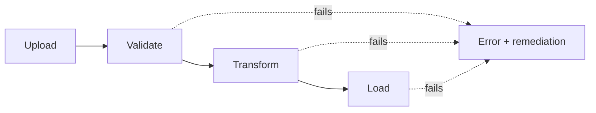
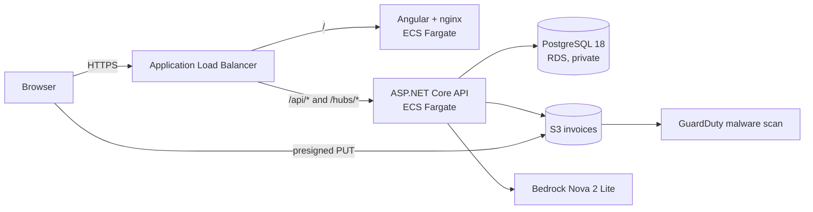
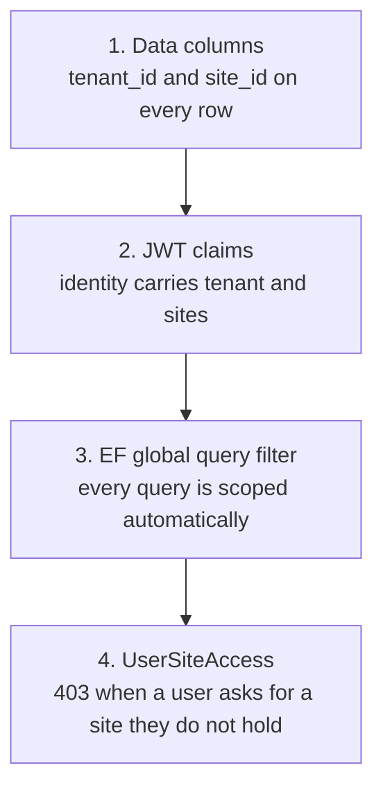
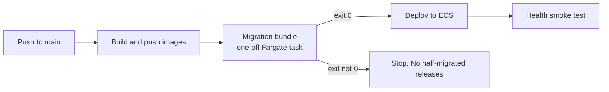

<div align="center">

# Document Processing Analytics Platform

**Upload a batch. Watch every file move through the pipeline. See exactly what broke and how to fix it.**

A multi-tenant document processing and monitoring platform with an ASP.NET Core backend, an Angular frontend and a full AWS deployment.

[](https://dotnet.microsoft.com/)
[](https://www.postgresql.org/)
[](https://angular.dev/)
[](infra/)
[](docs/AWS-Infrastructure.md)
[](.github/workflows)

[**Live site**](https://docanalytics.dev) · [**Wiki**](../../wiki) · [**AWS Infrastructure**](docs/AWS-Infrastructure.md) · [**Architecture**](ARCHITECTURE.md)

</div>

---

## What it does

Companies send in invoices and manifests by the thousand. Some files are broken, some are malicious and some just fail halfway through processing. This platform gives operators one place to see all of it.

It ingests batches of documents (PDF invoices, CSV manifests) and tracks each file through four stages:



Along the way it records every error with a suggested fix, extracts invoice line items with an LLM and serves dashboards over a REST API that the Angular app consumes.

## Highlights

| | |
|---|---|
| **Multi-tenant by design** | Four isolation layers keep customers and sites apart: data columns, JWT claims, an EF Core global query filter and `UserSiteAccess` enforcement that returns 403 (FR-5.3). |
| **Safe uploads** | Browsers upload straight to S3 through presigned URLs. Every file is scanned by GuardDuty Malware Protection and checked by magic bytes before any processing. |
| **AI extraction** | Invoice line items are pulled out with Amazon Bedrock (Nova 2 Lite) through the Converse API. |
| **Live updates** | SignalR hubs push pipeline progress to the browser. |
| **Clean layering** | `Api → Service → Data → Domain`. Controllers never touch `AppDbContext`. |
| **Real tests** | Separate test projects per layer, coverage tooling and a 100k file performance suite. |
| **One command deploys** | Push to `main` and GitHub Actions builds, migrates the database, deploys to ECS and runs a health check. No stored AWS keys. |

## Architecture



Inside the API the dependency direction is strict:

```
DocAnalytics.Api        controllers, auth, SignalR hubs
      ↓
DocAnalytics.Service    business logic, pipeline, integrations
      ↓
DocAnalytics.Data       EF Core, migrations, tenant query filter
      ↓
DocAnalytics.Domain     entities and rules, no dependencies
```

Full details: [Architecture wiki](../../wiki/Architecture) and [`ARCHITECTURE.md`](ARCHITECTURE.md).

## Tech stack

| Layer | Choice |
|---|---|
| Backend | ASP.NET Core Web API on **.NET 10**, EF Core 10 (migration based), JWT auth, BCrypt, Swagger |
| Database | **PostgreSQL 18**, snake_case via EFCore.NamingConventions |
| Frontend | **Angular 22**, standalone components, Signals, lazy loaded routes, functional interceptors |
| Cloud | ECS Fargate, ALB, RDS, S3, GuardDuty, Bedrock, Secrets Manager, Route 53, ACM |
| Delivery | Terraform for the platform, GitHub Actions with OIDC for deploys |
| Testing | xUnit, Vitest, coverlet and ReportGenerator |

> Early design docs say ".NET 8". The project targets **.NET 10 (`net10.0`)** and that is the source of truth.

---

## Quick start

### Prerequisites

- **.NET SDK 10.x**, **PostgreSQL 18**, **Git** and the `dotnet-ef` tool
  (`dotnet tool install --global dotnet-ef`, then open a fresh terminal)
- The **`postgres`** superuser password you set during install

### 1. Clone and open

```bash
git clone https://github.com/Akash29g/Document_Processing_Analytics.git
cd Document_Processing_Analytics
```

Open **`DocAnalytics.slnx`**. Do not create a new project.

### 2. Set secrets (git-ignored)

```bash
dotnet user-secrets set "ConnectionStrings:Default" "Host=localhost;Port=5432;Database=docanalytics;Username=postgres;Password=YOUR_LOCAL_PW" --project DocAnalytics.Api
dotnet user-secrets set "Jwt:Key" "any-32+-character-secret-key-for-local-dev" --project DocAnalytics.Api
```

> `Jwt:Key` must be at least 32 characters. The username and password must match a real PostgreSQL role.

### 3. Create the database

```bash
dotnet ef database update --project DocAnalytics.Data --startup-project DocAnalytics.Api
```

EF Core creates the `docanalytics` database if it is missing and builds all 12 tables. There is no hand-written SQL. The schema lives in migrations.

### 4. Run the API

```bash
dotnet watch run --project DocAnalytics.Api   # opens Swagger with hot reload
# or: dotnet run --project DocAnalytics.Api   # then open http://localhost:<port>/swagger
```

The first run seeds the database with 2 tenants, users, batches and more.

### 5. Run the frontend

```powershell
cd docanalytics-web
npm install        # one time, node_modules is git-ignored
ng serve -o        # serves at http://localhost:4200
```

Needs **Node.js 22+** and **Angular CLI 22** (`npm install -g @angular/cli`).

### 6. Log in

All seed users share the password `Password123!`

| Tenant | Users |
|---|---|
| Acme | `user.a@acme.com`, `user.b@acme.com`, `admin@acme.com` |
| Globex | `user.c@globex.com`, `admin@globex.com` |

Log in as users from both tenants and compare what each one can see. That is the quickest way to watch isolation work. The full roster and a smoke test are in the [API Reference wiki page](../../wiki/API-Reference).

---

## Frontend

The Angular app lives in `docanalytics-web/` and talks to the API under `/api/v1`.

| Screen | Purpose |
|---|---|
| **Dashboard** | Summary numbers for a site at a glance |
| **Batch Explorer** | Browse batches and drill into individual files |
| **Error Analysis** | See what failed, why and the suggested remediation |
| **Activity Log** | Audit trail of what happened and who did it |

Routes are nested and parameterized (`/site/:siteId/...`). State lives in Signals inside one injectable service per feature. HTTP goes through functional interceptors for auth, site selection and global error handling.

## Tenant and site isolation



A developer cannot forget a `Where` clause because there is no `Where` clause to forget. Details: [Tenant and Site Isolation wiki](../../wiki/Tenant-and-Site-Isolation).

---

## Running in the cloud

The production stack runs on AWS in `ap-south-1` at **https://docanalytics.dev**.

| Piece | What it is |
|---|---|
| Compute | ECS Fargate services for the API and the web app |
| Database | RDS PostgreSQL 18, private, reachable only from the app |
| Storage | S3 with presigned uploads and GuardDuty malware scanning |
| AI | Bedrock Nova 2 Lite for invoice extraction |
| Secrets | Secrets Manager, injected at task start |
| Platform as code | Terraform in [`infra/`](infra/) |
| Deploys | GitHub Actions through OIDC, no long-lived keys |

Every push to `main` runs this pipeline:



The migration step is gated. If the database migration fails the deploy stops before any new code goes live.

Everything else, including the resource inventory, security groups, IAM roles, secrets, a rebuild guide, a teardown runbook, cost estimates and troubleshooting, is in **[docs/AWS-Infrastructure.md](docs/AWS-Infrastructure.md)**.

---

## Quality

### Code coverage

**Backend** (coverlet + ReportGenerator). One time setup:

```powershell
dotnet tool install -g dotnet-reportgenerator-globaltool
```

Run:

```powershell
.\coverage.ps1 -Open   # runs all test projects and opens the HTML report in ./coverage-report
```

| Layer | Test project |
|---|---|
| Controllers (about 100%) | `DocAnalytics.Api.Tests` |
| Business logic | `DocAnalytics.Service.Tests` |
| Tenant isolation | `DocAnalytics.Data.Tests` |
| Domain entities | `DocAnalytics.Domain.Tests` |
| Performance | `DocAnalytics.Performance.Tests` |

Excluded from coverage: EF migrations, seeding, DI extensions and external integrations (S3, Bedrock, SignalR, SMTP). Those need integration tests rather than unit tests.

**Frontend** (Vitest):

```powershell
cd docanalytics-web
ng test --coverage --watch=false   # table in the terminal, report in ./coverage
```

Covers guards, interceptors, core services, feature services and shared components (about 76% of lines).

### Performance (NFR-1, mocked)

```powershell
dotnet test DocAnalytics.Performance.Tests
```

An in-memory simulation with no cloud needed. A shared xUnit fixture seeds **100k files (2,000 batches x 50)** once, then asserts the NFR-1 budgets:

| Check | Budget | Measured (P90) |
|---|---|---|
| Dashboard summary | under 3s | about 3ms |
| Paginated lists (50 per page) | under 1s | about 260ms worst case (error list) |
| 10 concurrent users | no degradation | about 23ms |

Concurrency is simulated with `Task.WhenAll` and a separate `DbContext` session per user. P50 and P90 timings are written to `perf-results/perf-report.md` and `perf-results/perf-report.csv`.

---

## Repository map

```
.
├── DocAnalytics.Api/                 controllers, auth, SignalR hubs
├── DocAnalytics.Service/             business logic and integrations
├── DocAnalytics.Data/                EF Core, migrations, tenant filter
├── DocAnalytics.Domain/              entities
├── DocAnalytics.*.Tests/             unit tests per layer
├── DocAnalytics.Performance.Tests/   100k file performance suite
├── docanalytics-web/                 Angular 22 frontend
├── infra/                            Terraform for the AWS platform
├── deploy/                           ECS task definitions used by CI/CD
├── docs/                             project documentation
├── perf/ and perf-results/           performance inputs and reports
├── scripts/                          helper scripts
├── .github/                          workflows
├── ARCHITECTURE.md                   design overview
└── DocAnalytics.slnx                 solution file
```

## Working on it

`main` is the runnable baseline. Work on `feature/*` or `fix/*` branches, open a PR and merge. Commits follow Conventional Commits (`feat:`, `fix:`, `docs:` and so on). Details: [Git Workflow wiki](../../wiki/Git-Workflow).

## Troubleshooting

Common local errors (`28P01`, `IDX10720`, empty results after a database reset) are covered in the [FAQ and Troubleshooting wiki](../../wiki/FAQ-and-Troubleshooting). Cloud issues are in section 10 of [docs/AWS-Infrastructure.md](docs/AWS-Infrastructure.md).

## Team

| | |
|---|---|
| **Dev A** | Akash Goswami |
| **Dev B** | Shubh Gupta |

Full design rationale: `Design_Tasks_1-3_updated.pdf`
